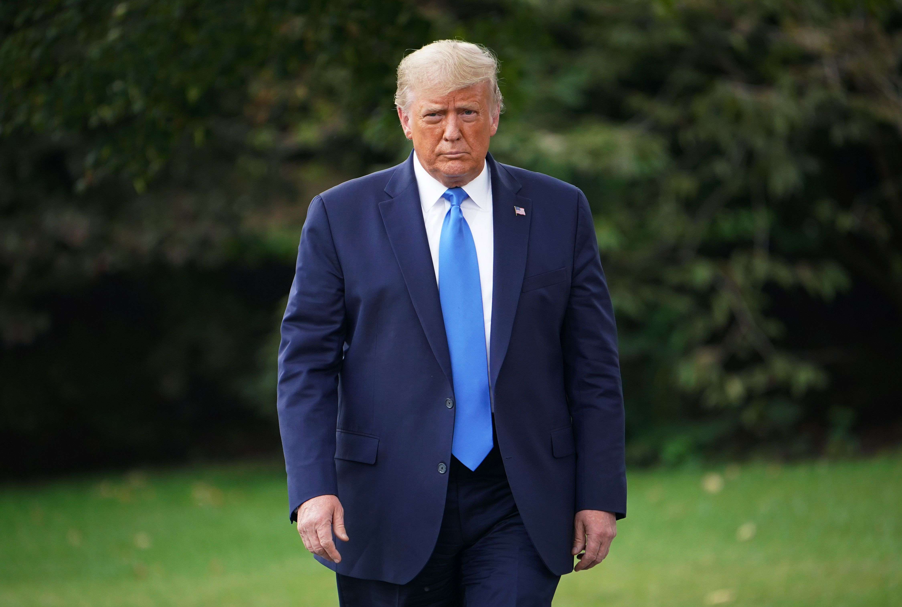
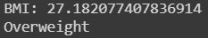
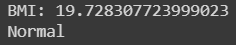

# BMI-prediction-from-Human-Photograph


[](https://opensource.org/licenses/MIT)

## Requirements

```
Python >= 3.6, Keras, TensorFlow
```

## Jupyter Notebook

For all the details, take a look at `bmi-prediction.ipynb`. There are a section called "Test with your photo!" to demo my pre-trained model with your own photo.

The model do a work better with a photo with whole single body.

## Visualization

* Source Image.

* Prediction.

* Source Image.

* Prediction.

